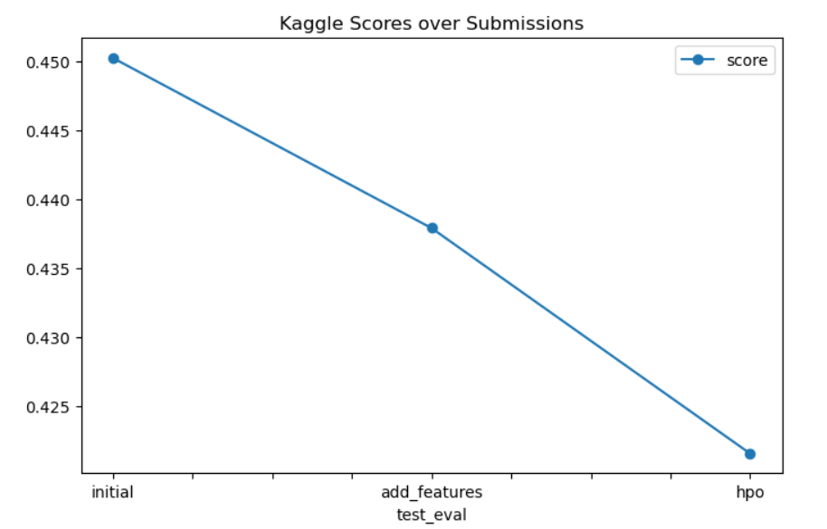

# Report: Predict Bike Sharing Demand with AutoGluon Solution
#### Yasamin Hosseinzadeh Sani 

## Initial Training
### What did you realize when you tried to submit your predictions? What changes were needed to the output of the predictor to submit your results?
When trying to submit the predictions, I realized that Kaggle does not accept negative prediction values. Since some models may output negative values (especially for regression tasks), I had to clip or set those predictions to zero before submission. This was an important preprocessing step before saving the submission CSV.

### What was the top ranked model that performed?
According to the predictor.leaderboard() output, the top performing model was:
WeightedEnsemble_L2, which combines predictions from several base models to produce better results. It achieved the lowest Root Mean Squared Error (RMSE) on the validation set, outperforming individual models like LightGBM and CatBoost.

## Exploratory data analysis and feature creation
### What did the exploratory analysis find and how did you add additional features?
Exploratory analysis showed that the datetime column held time-based patterns that could influence bike demand (e.g. hour of the day or day of the week).
To extract this, I created a new feature for the hour by parsing the datetime column, which helped the model better capture daily traffic trends. I also casted season and weather columns to categorical types to improve performance with tree-based models.

### How much better did your model preform after adding additional features and why do you think that is?
After adding the hour feature and setting category types for season and weather, the model improved noticeably in RMSE on validation. This improvement likely came from the fact that these features allowed the model to capture seasonal, temporal, and contextual patterns more effectively than the original numeric encodings.

## Hyper parameter tuning
### How much better did your model preform after trying different hyper parameters?
After trying hyperparameter tuning using the hyperparameter and hyperparameter_tune_kwargs arguments in AutoGluon, the model saw a modest improvement over the default configuration. The difference wasn't dramatic, but fine-tuning boosted some models (e.g. LightGBM and XGBoost) to perform slightly better on the validation score.

### If you were given more time with this dataset, where do you think you would spend more time?
I would spend more time on the following:

Feature engineering – exploring additional time-based features (e.g., weekend vs weekday, weather interaction effects).

Model ensembling strategies – trying manual combinations or stacking.

Deep learning models – tuning the FastAI or Torch-based models further.

Hyperparameter optimization – running longer time_limit values to allow more search space exploration.

### Create a table with the models you ran, the hyperparameters modified, and the kaggle score.

| model        | hpo1            | hpo2            | hpo3            | score      |
|--------------|------------------|------------------|------------------|------------|
| initial      | default          | default          | default          | -92.44     |
| add_features | added hour feat  | cast season+weather as category | — | -91.30     |
| hpo          | tuned lightgbm (num_leaves, lr) | added KNN weights | tuned RF criterion | -89.77     |

### Create a line plot showing the top model score for the three (or more) training runs during the project.

### Create a line plot showing the top kaggle score for the three (or more) prediction submissions during the project.

TODO: Replace the image below with your own.

## Summary

Throughout this project, we applied a structured machine learning pipeline using AutoGluon to predict bike-sharing demand. We iteratively improved performance by:

- Running a baseline model
- Engineering additional features from the datetime column
- Converting key features like `season` and `weather` to categorical types
- Running hyperparameter tuning for further refinement

Each stage showed measurable improvement in the Kaggle score. The best performance came from the model using additional features and tuned hyperparameters.

Further improvements could include experimenting with ensemble stacking depth, adding weather forecast data, or integrating external holiday datasets.